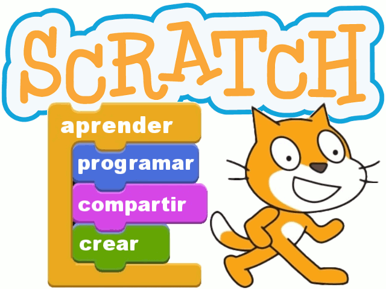
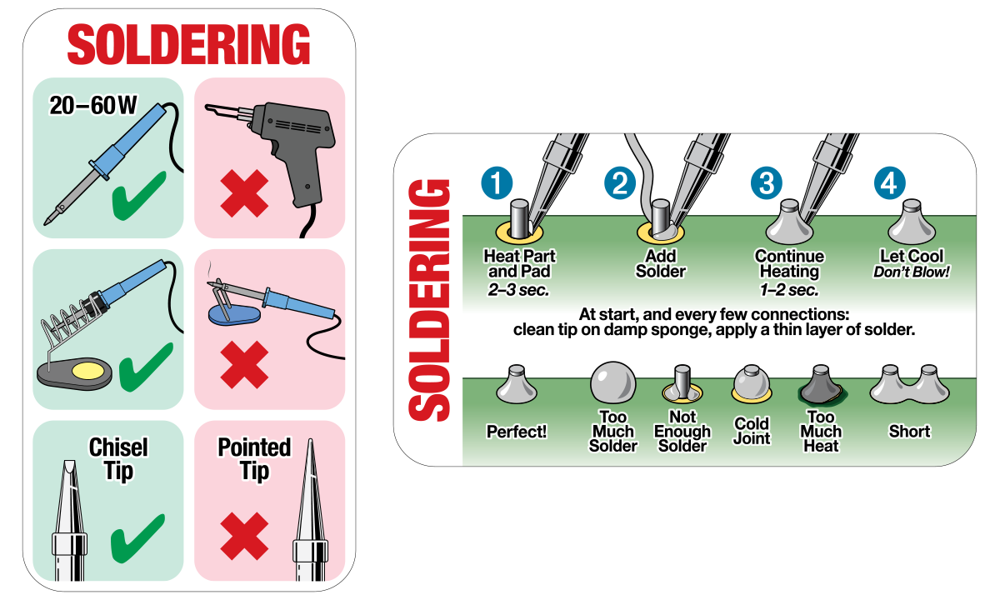

# @makerlab... Robótica & Programación '17

Página con contenidos de nuestro laboratorio de robótica y programación para jovenes.

<h2>Planificación del curso.....</h2>

<h2>Manuales.....</h2>

<table style="height: 38px;" width="459">
<tbody>
<tr>

<td></td>

<td></td>

<td></td>

</tr>

<tr>
<td></td>
<td>  

</td>

<td>
</td>
</tr>

<td>
</td>
</tr>

</tbody>
</table>

<h2>Aprendiendo a Soldar</h2>

https://jjviton.github.io/programRobots/
